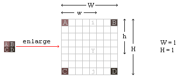
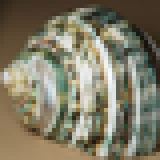
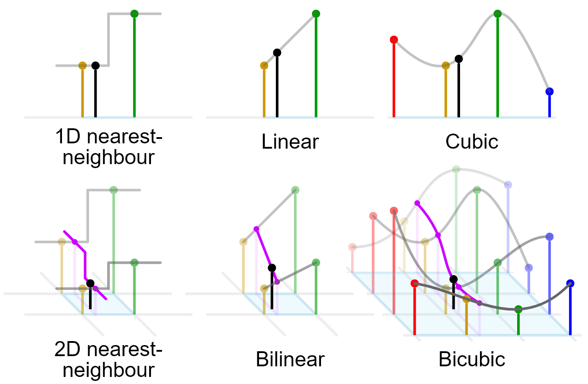

## Bilinear/Bicubic Scaling

Bilinear and bicubic are cleverer versions of nearest neighbour scaling, utilizing linear or cubic interpolation to generate pixels in the scaled up imagery. Bilinear scaling takes the distance between the unknown pixel and the known ones to give weight to the resulting colour values of the unknown pixel. It's an effective method of contextualising the value of the new pixel by performing an informed guess at brightness/colour values. 

In images, this kind of interpolation is typically performed in 2D, utilizing the data of 4 known points instead of two, hence bilinearity. In order to get the pixel data in a two dimensional space, the weighted 1 dimensional data between two pairs of points must be calculated based on the position of the intended pixel. To understand how this works, we'll take a quick look at the math behind it.

&nbsp;
|  |
|:--:|
| Bilinear scaling applied to a 2x2 square of pixels (Per Tech-Algorithm.com) |

In the above diagram, `Y` is the pixel we want to determine the value of. First we calculate the distances from `i` to `A` and `B`, and the distances from `j` to `C` and `D`, from which the resulting values can be plugged into the equation for `Y`. To achieve this, we can use the following linear equation to establish the colour values of `i` and `j`:

$i=A+\dfrac{d_1(B-A)}{d_2}$ 

where $d_1, d_2$ are the distances from `A` to `i` and `A` to `B` respectively. `i` is a value from 0-255 in a grayscale image. Repeat this with `j, C, D` and we've done the bulk of the work already!

So far we've only covered the linear portion of the calculation, the bilinear equation comes in when we plug the results of the two calculations into the same function again, but now solving for `Y`. This is equivalent to substituting the equations for `i` and `j`, creating a bilinear equation. 

$Y=i+\dfrac{d_1(j-i)}{d_2}$

This operation can be performed for every pixel between the four points to get an interpolated value. The end result is considerably better than the using nearest neighbour, as seen below.

| 

 | 
 
| 

 |
|:--:|:--:|:--:|
|Thumbnail Sized Image| Nearest Neighbour Scaling at x4 | Bilinear Scaling at 4x |
||Images provided by Wikimedia Commons||

Don't worry, you don't need glasses. While the bilinear scaling looks notably blurrier, it's also easier to discern the object in the image, even if you don't strictly gain any more data from it. So what about bicubic? Surely it gets you a sharper image right? Mostly. Let's take a look.

Bicubic works differently than bilinear, as that we've now graduated away from linear functions, and are instead using cubic splines. Cubic splines are a function utilizing 4 datapoints connected by a line defined by a cubic function. Below is a visual representation of the functions for each method we've discussed so far. The black point is the pixel data to be solved for.

|

|
|:--:|
|Image provided by Wikimedia Commons|

By utilizing a cubic function, we can better take into account the direction of the pixels as we attempt to gain a better understanding of how to fill the missing pixels. Unlike bilinear, where we only cared about the direction/distance of pixels in straight line, bicubic considers not just what's directly ahead of the pixel, but also what surrounds it. Instead of just 4 pixels, bicubic interpolation requires a total of 16 points in the image to compare against for every missing data point, not concerning itself with if these 16 points are in a straight line. This helps improve the overall sharpness and contrast of the resulting image, but it is more computationally taxing.

Let's take a look at the differences between bilinear and bicubic interpolation methods based on their results.

| 

 | 
 
| 

 |
|:--:|:--:|:--:|
|Thumbnail Sized Image| Bilinear Scaling at 4x | Bicubic Scaling at 4x |
||Images provided by Wikimedia Commons||

The differences aren't quite so drastic as from Nearest Neighbour to Bilinear, but the improvements are evident. The colours come through more clearly, and the shell has greater definition overall. It's still blurry, but considering the source image is a measely resolution of 40x40, it does pretty well.

So far, this journey through increasingly complex scaling methods has shown us that the more data we have to work with, the better the outcome 