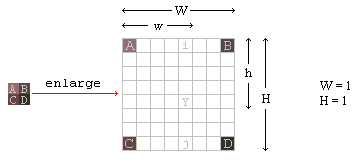
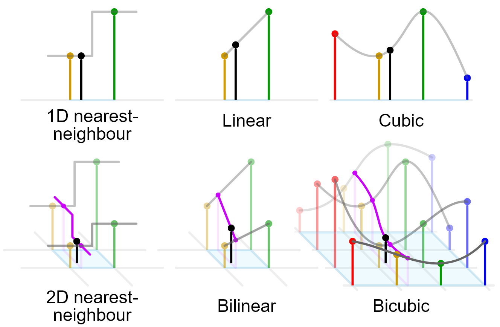

# Data Mining and Image Upscaling
by Greg Savage

Date: March 28th 2022

&nbsp;

&nbsp;

Data mining is for more than just finding out what kind of products you're likely to buy based on your Google search history. It's used for a wide variety of data manipulation and is a much more abstract approach to how we interpret large sums of data in general. While image data is typically much more uniform in design than scatterd points of data, there is still a need to establish relationships between the individual pixels and the image when performing image manipulation that depends on the context of the image as a whole. In this way, there are several data mining techniques employed during image processing. Before we get to that however, some background knowledge is required.

&nbsp;
## What is image upscaling?

In a world where display technology is driven by panels consisting of many individual pixels, there remains a question: "What do you do when the image you want to display doesn't have the same number of pixels as your display?"

The answer is image scaling, or for the purposes of this discussion, image upscaling. That is, taking an image that is of a smaller resolution than intended, and resizing the image to the desired resolution without loss of detail. There are a number of techniques to achieve this, the simplest of which have been employed for decades and are commonly used in home electronics. As technology has improved, less conventional techniques that rely on machine learning and AI have also been introduced. These more advanced techniques are even capable of not just preserving detail, but improving upon it. 

| 

 | 
 
 |
 |:--:|:--:|

Follow along as we try to upscale the left shell to match the detail in the right shell.

&nbsp;
## Nearest Neighbour Scaling

One of the most common, and easiest to implement scaling algorithms is nearest neighbour scaling. Nearest neighbour works by considering only the pixel closest to the unknown pixel, typically chosen by means of floor division. It copies exactly the same data from the known nearest pixel to its own position to perform the scaling as required. This technique provides the basis for several other scaling techniques, but on it's own, it's typically quite primitive.

|  |
|:--:|
|Example of neighbour interpolation as applied to a 4x4 cell of pixels. (Per Tech-Algorithm.com)|

The benefits of nearest neighbour scaling are limited to its speed, rather than its effectiveness. For the practice of zooming into an image, or trying to preserve the styling of retro games, it's relatively effective, but in many cases, its drawbacks largely outweigh its efficiency. Nearest neighbour works best in cases where images are scaled uniformly and aliasing is not a concern. Due to the nature of the algorithm, copying pixel data rather than assessing new potential pixel data that may lend to enhance existing detail, so the upscaled result does not truly benefit measures taken to enhance the fidelity of the image itself. For that, we'll need something a tad more robust.  

&nbsp;
## Bilinear/Bicubic Scaling

Bilinear and bicubic are cleverer versions of nearest neighbour scaling, utilizing linear or cubic interpolation to generate pixels in the scaled up imagery. Bilinear scaling takes the distance between the unknown pixel and the known ones to give weight to the resulting colour values of the unknown pixel. It's an effective method of contextualising the value of the new pixel by performing an informed guess at brightness/colour values. 

In images, this kind of interpolation is typically performed in 2D, utilizing the data of 4 known points instead of two, hence bilinearity. In order to get the pixel data in a two dimensional space, the weighted 1 dimensional data between two pairs of points must be calculated based on the position of the intended pixel. To understand how this works, we'll take a quick look at the math behind it.

&nbsp;
|  |
|:--:|
| Bilinear scaling applied to a 2x2 square of pixels (Per Tech-Algorithm.com) |

In the above diagram, `Y` is the pixel we want to determine the value of. First we calculate the distances from `i` to `A` and `B`, and the distances from `j` to `C` and `D`, from which the resulting values can be plugged into the equation for `Y`. To achieve this, we can use the following linear equation to establish the colour values of `i` and `j`:

$i=A+\dfrac{d_1(B-A)}{d_2}$ 

where $d_1, d_2$ are the distances from `A` to `i` and `A` to `B` respectively. `i` is a value from 0-255 in a grayscale image. Repeat this with `j, C, D` and we've done the bulk of the work already!

So far we've only covered the linear portion of the calculation, the bilinear equation comes in when we plug the results of the two calculations into the same function again, but now solving for `Y`. This is equivalent to substituting the equations for `i` and `j`, creating a bilinear equation. 

$Y=i+\dfrac{d_1(j-i)}{d_2}$

This operation can be performed for every pixel between the four points to get an interpolated value. The end result is considerably better than the using nearest neighbour, as seen below.

| 

 | 
 
| 

 |
|:--:|:--:|:--:|
|Thumbnail Sized Image| Nearest Neighbour Scaling at x4 | Bilinear Scaling at 4x ||
||Images provided by Wikimedia Commons||

Don't worry, you don't need glasses. While the bilinear scaling looks notably blurrier, it's also easier to discern the object in the image, even if you don't strictly gain any more data from it. So what about bicubic? Surely it gets you a sharper image right? Mostly. Let's take a look.

Bicubic works differently than bilinear, as that we've now graduated away from linear functions, and are instead using cubic splines. Cubic splines are a function utilizing 4 datapoints connected by a line defined by a cubic function. We won't go deeply into the math for bicubic functions, as the background provided by the bilinear functions discussed earlier is sufficient for understanding the relationships between the known and unknown pixels.

Below is a visual representation of the functions for each method we've discussed so far, and how they apply in a two-dimensional space. The black point is the pixel data to be solved for, and the coloured points are known pixel values.

|

|
|:--:|
|Image provided by Wikimedia Commons|

By utilizing a cubic function, we can better take into account the direction of the pixels as we attempt to gain a better understanding of how to fill the missing pixels. Unlike bilinear, where we only cared about the direction/distance of pixels in straight line, bicubic considers not just what's directly ahead of the pixel, but also what surrounds it. Instead of just 4 pixels, bicubic interpolation requires a total of 16 known points in radius of the missing data point. This helps improve the overall sharpness and contrast of the resulting image, but it is more computationally taxing due to the need to solve for substantially more unknown variables (coefficients) that contribute to the unknown pixel's final value.

Let's take a look at the differences between bilinear and bicubic interpolation methods based on their results.

| 

 | 
 
| 

 |
|:--:|:--:|:--:|
|Thumbnail Sized Image| Bilinear Scaling at 4x | Bicubic Scaling at 4x |
||Images provided by Wikimedia Commons||

The differences aren't quite so drastic as from Nearest Neighbour to Bilinear, but the improvements are evident. The colours come through more clearly, and the shell has greater definition overall. It's still blurry, but considering the source image is a measely resolution of 40x40, it does pretty well. Bicubic does have its own drawbacks, however. While it's useful for images where depth/contrast are a concern, it's ill-suited to scaling simplistic images with hard separations between colour areas, opting instead to blend or oversharpen these elements. 

So far, this journey through increasingly complex scaling methods has shown us that the more data we consider, the better the outcome. So how can we better utilize the data in the image? Clearly there's still improvements to be made, as the product of both bilinear and bicubic scaling is evidently not ideal in cases where the image is scaled up to several times its original size. While there are other scaling algorithms, there's a considerable falloff to their returns compared to their computational requirements. Instead, we now turn to AI and deep learning algorithms to not just interpolate pixel data, but to predict and imagine it. 

&nbsp;
## Deep Learning and AI Scaling

In recent years, deep learning, otherwise known as machine learning, is a common tool for identifying and generating new data based on patterns found in other related datasets. It's become a powerful means to rapidly explore variations of data that would otherwise be tedious to replicate on their own. While deep learning is used in scaling technologies for both real-time and long-form image processing, it's still very much in its early stages and is constantly improving.

So what sets these methods apart from the traditional algorithms we discussed? One of the greatest challenges of traditional approaches to image scaling, is that the algorithms available to us only take into account the image data being operated on, and lack context in a worldly sense. Deep learning sets out to fill in these gaps by utilising large amounts of data to effectively train a program to recognize patterns and details that are commonly associated with the imagery we intend to scale. This training is accomplished through the use of what's called a "deep convolutional neural network". We'll focus on two different kinds of neural networks and try to break down their differences and advantages, but first we need some background on neural networks. 

We refer to these systems as neural networks, because each element of the network is comprised of an electronic representation of a neuron, like we have in our brain to process sensory signals. In short, their goal is to act like gates that open or close based on whether a set of conditions are met. The data that makes it to the end of the gates is our output, and is the end result we can then utilise.

So how do we apply this to image scaling? Well, you can consider each image to be a dataset. For specific varieties of images, we can train the neural network to recognize common elements. The more general the set of images we feed it, the more general the relationships it will establish, and vice versa. Once trained, what we're left with is called a "model"; a collection of pathways used to determine how data should be received and the resulting values based on those pathways. 

### Enhanced Deep Residual Networks (EDSR)

There have been several tools developed that take advantage of EDSRs, notably waifu2x and Neural Enhance. These two tools utilise EDSRs to "hallucinate" details in the upscaled images, producing details that weren't there and are not strictly correct, but present accurately enough to be acceptable for the context of the image. 

The particular form of EDSR we'll be looking at was developed in 2017 by a team of researchers at the University of Seoul, Korea. It's designed to allow for more natural training by allowing the network to skip some layers of neurons in the network if it produces a better result. This opens more pathways, allowing less strict relationships to be formed when interpreting data. This is necessary, as in some cases more complexity introduced by the additional layers may produce incorrect results. The end result of this construction allows for more accurate predictions of missing data values.

Let's take a look at a couple of examples.

|  |
|:--:|
| Implementation of EDSR at 4x scaling (per Martin Krasser's Super-Resolution library) |

The left is our original image, and the right is our scaled version. Here we see both the strengths and weaknesses of this method of scaling. We can definitely identify that there's much greater detail in the image, but it's not "real" detail. Instead, the EDSR has produced a version of the image it thinks is correct based on the data it was trained on. Where there were straight lines in the original image, there appear almost curves and waves, like the image was painted or smudged. The lights along the dome also end up oversharpened, the EDSR enhancing the artifacts of the camera lens.

Despite its flaws however, let's consider the difference to the previous scaling methods we've discussed. This time, we'll compare bilinear, bicubic and EDSR scaling methods.

| 
 
| 

 | 

  |
|:--:|:--:|:--:|
| Bilinear 4x | Bicubic 4x | EDSR 4x |
||Images provided by Wikimedia Commons||

Compared to bicubic, the level of detail now present in the image is substantial. While the bilinear and bicubic counterparts feel blurry, the EDSR result is far sharper, even if the texture and colours blend into one another as a result of the hallucination produced by the neural network. Hallucination itself is a product of how the network understands the patterns in the images. 

### Enhanced Generative Adversarial Network and Super Resolution GAN (ESRGAN)

A generative adversarial network, or GAN, is designed to pit two neural networks against eachother in an attempt to improve the results of both. These two networks are described as a generator and a descriminator. The generator's job is to produce data similar to the data the discriminator is trained on, but that is fake or misleading. The discriminator is then asked to determine if the fake data is real or not, and its ability to determine this assists in training it to recognise patterns in the data that it should avoid. 

This brings us back to tackling hallucination in deep learning upscaling. By providing and establishing relationships between fake and real versions of the images in the dataset the discriminator is trained on, it's more likely to produce correct results. The key to solving the hallucination problem is being able to recognise hallucination artificats in images that a neural network produces. If we can produce images that are close but not quite right, while comparing them to training data that is correct, the network begins to identify relationships that more closely match the expected result. This relationship is described as "loss" and provides a direct metric for how close it is to the real image vs the fake one. The closer to the real, the better. This is how SRGAN tackles upscaling without the negative effects of hallucination artifacts.

So how does it stack up? 

| 
 
| 

 | 

  |
|:--:|:--:|:--:|
| EDSR 4x | ESRGAN 4x | Real Image |
||Images provided by Wikimedia Commons||

Compared to the EDSR result on the left, ESRGAN reintroduces a much greater degree of detail, eliminating much of the artificating caused by EDSR's less refined hallucination. Compared to the real image, it's shockingly similar, and highlights the power of neural network scaling over traditional methods. 

As new methods of scaling improve, we're sure to see even greater improvements in detail as time goes on. Even now, we're starting to see models trained by neural networks take on real-time roles in scaling content in real world environments through technologies like DLSS and XeSS in video games and video processing.

&nbsp;
## Sources:
https://github.com/krasserm/super-resolution

https://arxiv.org/pdf/1707.02921.pdf

https://tech-algorithm.com/articles/nearest-neighbor-image-scaling/

https://tech-algorithm.com/articles/bilinear-image-scaling/

https://towardsdatascience.com/introduction-to-resnets-c0a830a288a4

https://peaceful0907.medium.com/generative-adversarial-network-and-super-resolution-gan-srgan-e2e7a4440066

https://arxiv.org/pdf/1809.00219.pdf