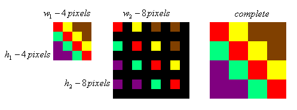

# Data Mining and Image Upscaling

Data mining is for more than just finding out what kind of products you're likely to buy based on your Google search history. It's used for a wide variety of data manipulation and is a much more abstract approach to how we interpret large sums of data in general. While image data is typically much more uniform in design than scatterd points of data, there is still a need to establish relationships between the individual pixels when performing image manipulation that depends on the context of the image as a whole. In this way, there are several data mining techniques employed during image processing. Before we get to that however, some background knowledge is required.

&nbsp;
## What is image upscaling?

In a world where display technology is driven by panels consisting of many individual pixels, there remains a question: "What do you do when the image you want to display doesn't have the same number of pixels as your display?"

The answer is image scaling, or for the purposes of this discussion, image upscaling. That is, taking an image that is of a smaller resolution than intended, and resizing the image to the desired resolution without loss of detail. There are a number of techniques to achieve this, the simplest of which have been employed for decades and are commonly used in home electronics. As technology has improved, less conventional techniques that rely on machine learning and AI have also been introduced. These more advanced techniques are even capable of not just preserving detail, but improving upon it. 

&nbsp;
## Nearest Neighbour Scaling

One of the most common, and easiest to implement scaling algorithms is nearest neighbour scaling. Nearest neighbour works by considering only the pixel closest to the unknown pixel, typically chosen b 

|  |
|:--:|
|Example of neighbour interpolation as applied to a 4x4 cell of pixels. (Per Tech-Algorithm.com)|

The benefits of nearest neighbour scaling are limited to its speed, rather than its effectiveness. For the practice of zooming into an image, or trying to preserve the styling of retro games, it's relatively effective, but in many cases, its drawbacks largely outweigh its efficiency. Nearest neighbour works best in cases where images are scaled uniformly and aliasing is not a concern. Due to the nature of the algorithm, copying pixel data rather than assessing new potential pixel data that may lend to enhance existing detail, so the upscaled result does not truly benefit measures taken to enhance the fidelity of the image itself. For that, we'll need something a tad more robust.  

&nbsp;
## Bilinear/Bicubic Scaling

Bilinear and bicubic are cleverer versions of nearest neighbour scaling, utilizing linear or cubic interpolation to generate pixels in the scaled up imagery. Bilinear scaling takes the distance between the unknown pixel and the known ones to give weight to the resulting colour values of the unknown pixel. It's an effective method of contextualising the value of the new pixel by performing an informed guess at brightness/colour values. 

In images, this kind of interpolation is typically performed in 2D, utilizing the data of 4 known points instead of two, hence bilinearity. In order to get the pixel data in a two dimensional space, the weighted 1 dimensional data between two pairs of points must be calculated based on the position of the intended pixel. To understand how this works, we'll take a quick look at the math behind it.

&nbsp;
|  |
|:--:|
| Bilinear scaling applied to a 2x2 square of pixels (Per Tech-Algorithm.com) |

In the above diagram, `Y` is the pixel we want to determine the value of. First we calculate the distances from `i` to `A` and `B`, and the distances from `j` to `C` and `D`, from which the resulting values can be plugged into the equation for `Y`. To achieve this, we can use the following linear equation to establish the colour values of `i` and `j`:

$i=A+\dfrac{d_1(B-A)}{d_2}$ 

where $d_1, d_2$ are the distances from `A` to `i` and `A` to `B` respectively. `i` is a value from 0-255 in a grayscale image. Repeat this with `j, C, D` and we've done the bulk of the work already!

So far we've only covered the linear portion of the calculation, the bilinear equation comes in when we plug the results of the two calculations into the same function again, but now solving for `Y`. This is equivalent to substituting the equations for `i` and `j`, creating a bilinear equation. 

$Y=i+\dfrac{d_1(j-i)}{d_2}$

This operation can be performed for every pixel between the four points to get an interpolated value. The end result is considerably better than the using nearest neighbour, as seen below.

| 

 | 
 
| 

 |
|:--:|:--:|:--:|
|Thumbnail Sized Image| Nearest Neighbour Scaling at x4 | Bilinear Scaling at 4x |
||Images provided by Wikimedia Commons||

Don't worry, you don't need glasses. While the bilinear scaling looks notably blurrier, it's also easier to discern the object in the image, even if you don't strictly gain any more data from it. So what about bicubic? Surely it gets you a sharper image right? Mostly. Let's take a look.

Bicubic works differently than bilinear, as that we've now graduated away from linear functions, and are instead using cubic splines. Cubic splines are a function utilizing 4 datapoints connected by a line defined by a cubic function. We won't go deeply into the math for bicubic functions, as the background provided by the bilinear functions discussed earlier is sufficient for understanding the relationships between the known and unknown pixels.

Below is a visual representation of the functions for each method we've discussed so far, and how they apply in a two-dimensional space. The black point is the pixel data to be solved for, and the coloured points are known pixel values.

|

|
|:--:|
|Image provided by Wikimedia Commons|

By utilizing a cubic function, we can better take into account the direction of the pixels as we attempt to gain a better understanding of how to fill the missing pixels. Unlike bilinear, where we only cared about the direction/distance of pixels in straight line, bicubic considers not just what's directly ahead of the pixel, but also what surrounds it. Instead of just 4 pixels, bicubic interpolation requires a total of 16 known points in radius of the missing data point. This helps improve the overall sharpness and contrast of the resulting image, but it is more computationally taxing due to the need to solve for substantially more unknown variables (coefficients) that contribute to the unknown pixel's final value.

Let's take a look at the differences between bilinear and bicubic interpolation methods based on their results.

| 

 | 
 
| 

 |
|:--:|:--:|:--:|
|Thumbnail Sized Image| Bilinear Scaling at 4x | Bicubic Scaling at 4x |
||Images provided by Wikimedia Commons||

The differences aren't quite so drastic as from Nearest Neighbour to Bilinear, but the improvements are evident. The colours come through more clearly, and the shell has greater definition overall. It's still blurry, but considering the source image is a measely resolution of 40x40, it does pretty well.

So far, this journey through increasingly complex scaling methods has shown us that the more data we consider, the better the outcome. So how can we better utilize the data in the image? Clearly there's still improvements to be made, as the product of both bilinear and bicubic scaling is evidently not idea in cases where the image is scaled up to several times its original size.